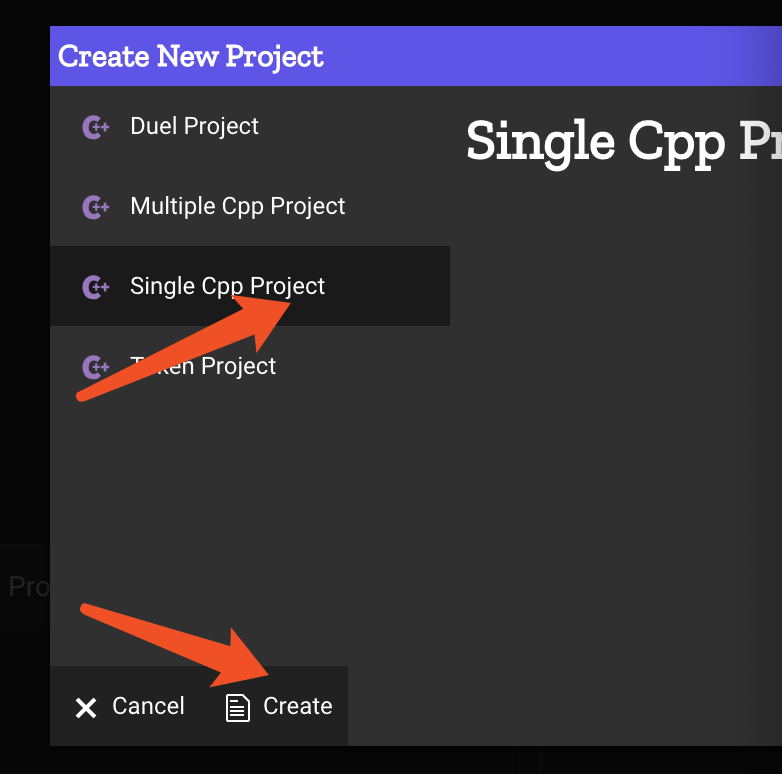
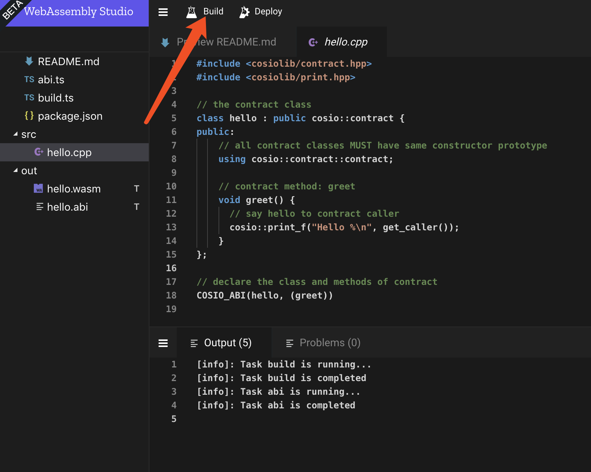
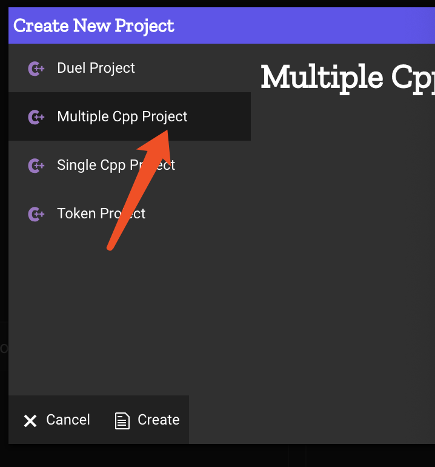

# web compiler

For now, it is difficute to build a environment to compile contract. To make it easier, we provided a online compiler in [webassembly](http://studio.contentos.io/).

## Build

There are four typies of templates, and single cpp project is the simplest.

It automatically generate hell world contract. Click build to generate .wasm file and .abi file. The wasm file is the compiled source code of contract and abi add type information to it. Read [contract](./contract.md) to know more. Download .wasm file and .abi, deploy them by wallet. Read [wallet](./wallet.md) to know more about deploy contract by wallet.

## Rename

Default name is hello.cpp if wanted to use another, need rename.
Rename hello.cpp in src is not enough, should also rename `src/hellp.cpp` in abi.ts and build.ts.

## Multiple Cpp Project

Multiple Cpp Project is similiar with Single Cpp Project, but should include all files into abi.ts and build.ts. Read the source code generated by Multiple Cpp Project template.

