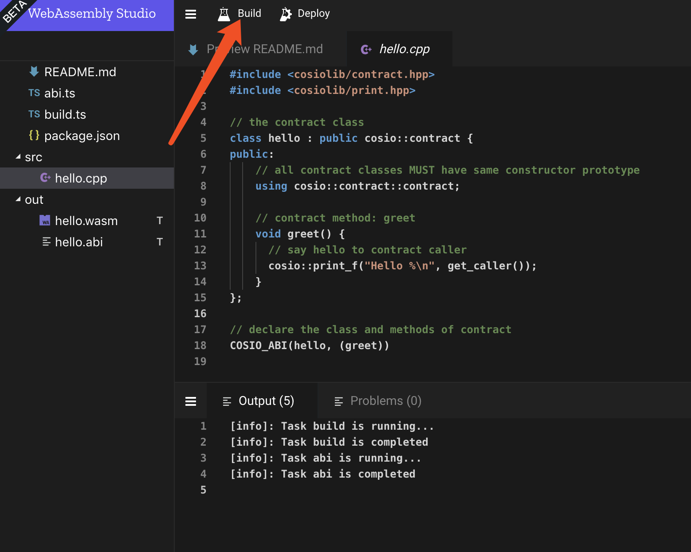

# web compiler

目前 coschain 的合约编译环境部署十分复杂，为了方便编译，我们提供了在线的编译网站。地址是 [webassembly](http://studio.contentos.io/)。

## 构建

目前提供了四种合约模板，大多数情况下，单文件的合约已经够用了。所以从单文件工程开始。

单工程会自动生成 hello world 合约的代码，点击 build 以生成 .wasm 文件和 .abi 文件。wasm 文件是真正的合约代码，abi 文件提供类型信息。更详细的说明请查阅 [contract](./contract.md)。下载 .wasm 文件以及 .abi 到本地，通过 wallet 部署合约。wallet 部署合约的内容请查看 [wallet](./wallet.md)。

## 重命名

如果不希望合约名叫做 hello，那么重命名是有必要的。
仅仅修改 src 中的 hello.cpp 的名字是不够的，需要修改 abi.ts 与 build.ts 中的 `src/hello.cpp` 为自己希望的名字。

## 多文件工程

多文件工程和单文件工程本质上没有区别，需要注意的是需要在 abi.ts 与 build.ts 需要把所有的文件都包括进去。可以参考 Multiple Cpp Project 的配置。

